# Image Inpainting

Try the methods from [deep image prior](https://openaccess.thecvf.com/content_cvpr_2018/html/Ulyanov_Deep_Image_Prior_CVPR_2018_paper.html) and [stable diffusion](https://huggingface.co/docs/diffusers/using-diffusers/sdxl#refine-image-quality). A comparison of a no pre-trained method and a well-trained model for image inpainting. 

Next step: Implement algorithm to automatically find watermark mask in the image.

## recover a watermark in the image: 

### Some steps in deep image prior. recover the image from a random image.
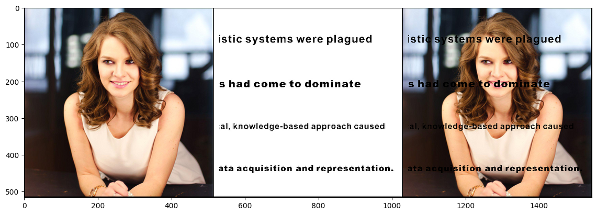 
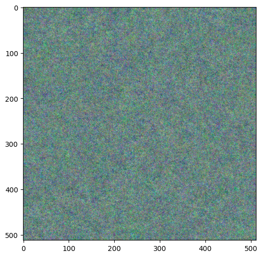 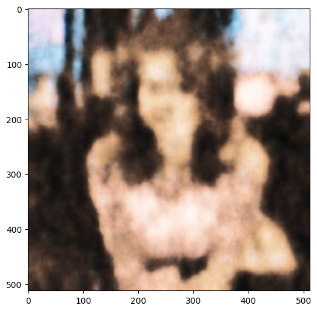 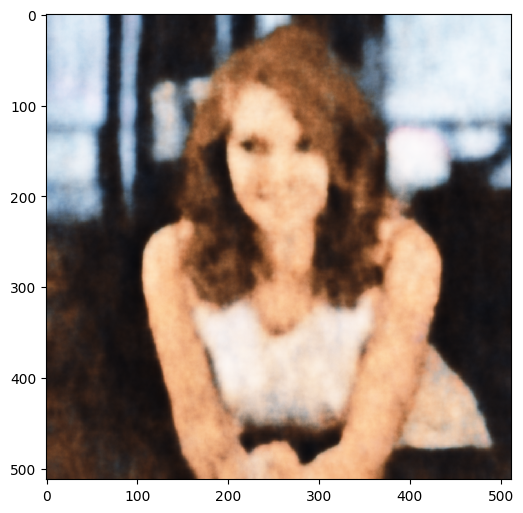 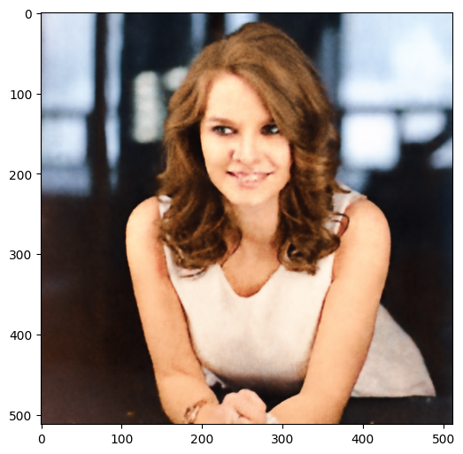  

### Comparasion (Add a cat shape waterprint)
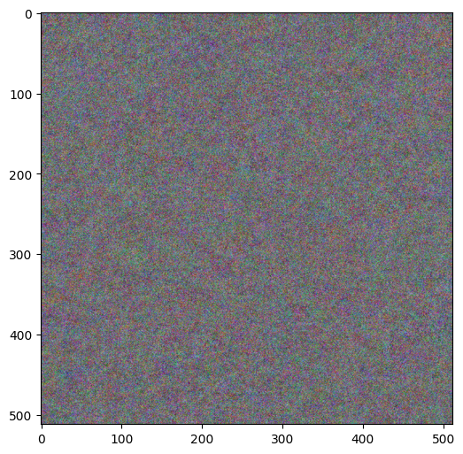 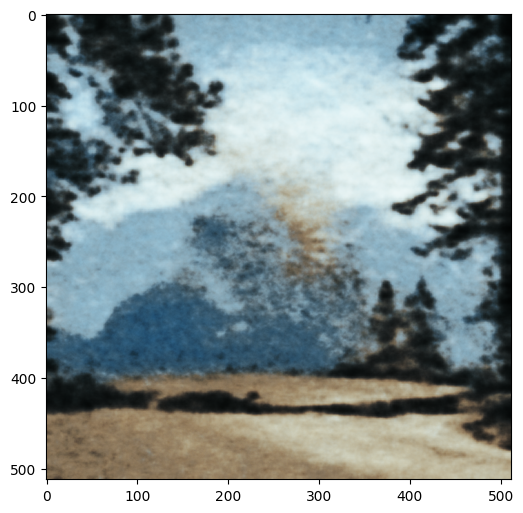 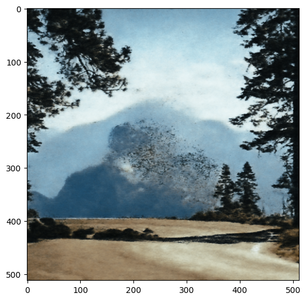 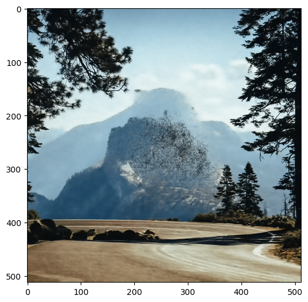 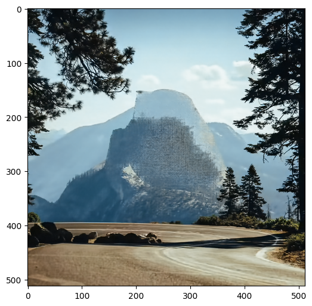 

### Diffusion result:

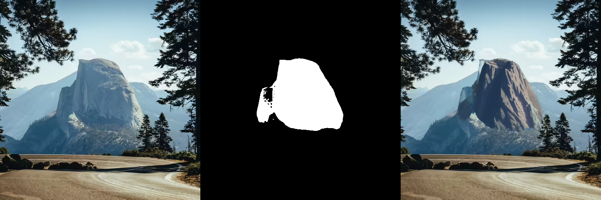 

### Diffusion model can draw new object by prompt

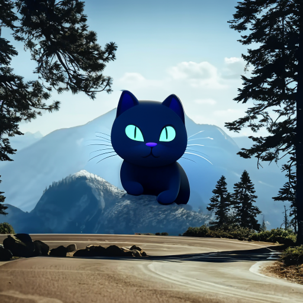 
